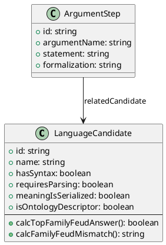

# Uml Language Candidate

UML diagram generation from the Effortless Rulebook.

Future implementation will generate PlantUML or Mermaid class diagrams, entity-relationship diagrams, and sequence diagrams.

## Technology

**UML (Unified Modeling Language)** is the ISO/IEC 19501 standard for software modeling diagrams. For code generation, text-based UML tools like PlantUML and Mermaid allow diagrams to be version-controlled, diffed, and generated programmatically.

Key characteristics:
- **Text-to-diagram**: PlantUML and Mermaid convert plain text to rendered diagrams
- **Multiple diagram types**: Class, entity-relationship, sequence, state, activity diagrams
- **Embeddable**: Markdown, wikis, and documentation systems render these inline
- **Diff-friendly**: Text representations enable meaningful version control

ERB UML exports (PlantUML class diagram):

## Status

This is a placeholder generated by the ERB orchestration system.

## Source

Generated from: `effortless-rulebook/effortless-rulebook.json`

## Generated

2026-01-31 21:19:40
